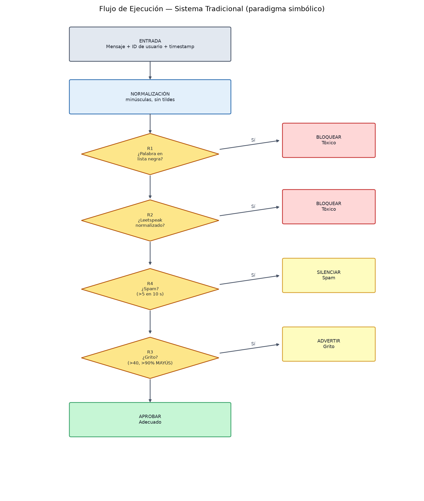
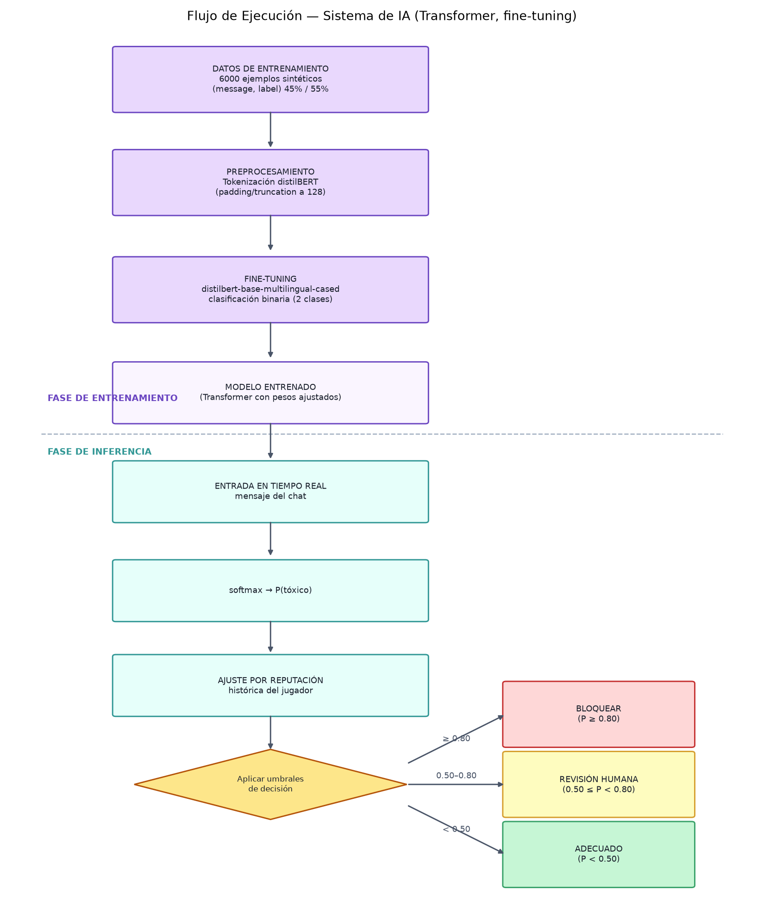
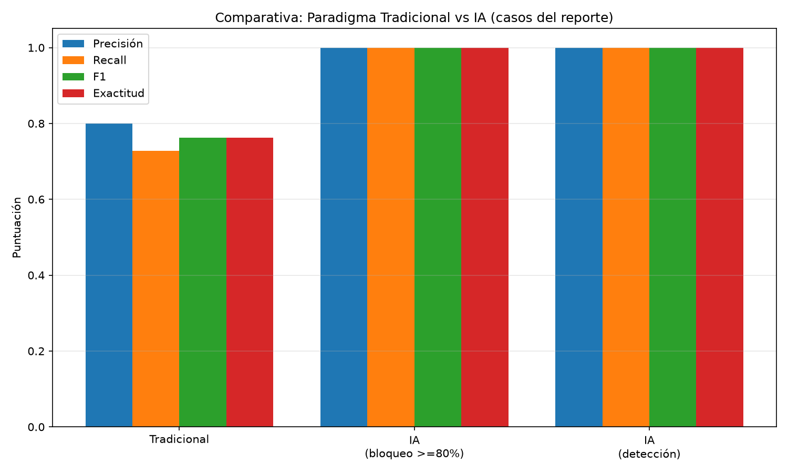

# Actividad 1.1 — Comparativa de Paradigmas: Tradicional vs. Inteligencia Artificial

**Curso:** Inteligencia Artificial
**Problema seleccionado:** Moderación automática de toxicidad en chats de videojuegos en línea.
**Equipo/Estudiante:** \_\_\_\_\_\_\_\_\_\_\_\_\_\_\_\_\_\_\_\_\_\_\_\_\_\_\_\_\_\_\_\_\_\_\_\_\_
**Fecha:** \_\_\_\_\_\_\_\_\_\_\_\_\_\_\_\_\_\_\_\_\_\_\_\_\_\_\_\_\_\_\_\_\_\_\_\_\_

---

## Resumen ejecutivo

Se diseña e implementan **dos soluciones completas** para el mismo problema real: detectar y
sancionar mensajes tóxicos en chats de videojuegos online.

1. **Enfoque 1 — Tradicional (paradigma simbólico):** un programa con **4 reglas de negocio**
   explícitas escritas a mano con lógica `IF/ELSE` (lista negra, leetspeak, gritos y spam).
2. **Enfoque 2 — IA (Machine/Deep Learning):** una **red neuronal tipo Transformer**
   (`distilbert-base-multilingual-cased`) que **aprende las reglas a partir de los datos** mediante
   fine-tuning sobre un dataset sintético de 6000 mensajes etiquetados en español.

La evidencia empírica (`reports/comparativa_report.md`) muestra que la IA supera al enfoque
tradicional en precisión, recall y F1, principalmente porque entiende **contexto** y **sarcasmo**,
mientras que el tradicional cae en **falsos positivos** al comparar solo palabras. Además, se
desplegó el sistema como un **bot de Discord** funcional (moderación en vivo).

---

# Parte A — Definición del Problema

## A.1 Descripción

En los videojuegos en línea, el chat de voz/texto es un canal de comunicación central, pero también
un espacio donde aparecen **insultos, acoso, sarcasmo ofensivo y spam**. Los jugadores pueden
ofenderse, abandonar la partida o la plataforma, y las comunidades pierden calidad. Moderar
manualmente miles de mensajes por segundo es imposible, por lo que se necesita un **sistema
automático de moderación**.

El reto principal no es solo bloquear la grosería explícita, sino distinguir casos difíciles:

- **Falso positivo:** *"este nivel es un infierno de difícil"* contiene la palabra *infierno*, pero
  es una queja legítima del juego, no una agresión.
- **Contexto de juego:** *"la rata del jefe del nivel 3 es difícil de matar"* habla de un enemigo
  del juego, mientras que *"tú eres una rata"* es un insulto.
- **Sarcasmo:** *"claro, excelente jugada genio"* no contiene ninguna palabra prohibida, pero es
  ofensivo por el tono.

## A.2 Resultado esperado (Salida)

Para **cada mensaje** el sistema debe producir una decisión (salida discreta y accionable):

| Salida | Significado | Acción sugerida |
|---|---|---|
| `ADECUADO` | Mensaje aceptable | Permitirlo |
| `TOXICO` | Insulto/agresión (directo o por leetspeak) | Bloquearlo y sancionar al autor |
| `GRITO` | Mensaje largo en mayúsculas | Advertir |
| `SPAM` | Mismo mensaje repetido en ventana corta | Silenciar |
| `REVISION_HUMANA` | Toxicidad ambigua (solo IA) | Cola de moderación humana (Human-in-the-Loop) |

**Entrada (Input):** el texto del mensaje + identificación del usuario + timestamp. En el sistema de
IA se añade además la **reputación histórica** del jugador.

---

# Parte B — Enfoque 1: Proyecto Tradicional (Basado en Programación)

En este enfoque **el programador escribe las reglas**. La "inteligencia" está en el código explícito:
si aparece una palabra, se bloquea; si no, se pasa a la siguiente comprobación. El sistema vive en
`src/traditional/` y fue probado con tests unitarios (`tests/run_tests.py`, 16 tests PASS).

## B.1 Reglas de Negocio (IF/ELSE explícitas)

### Regla R1 — Palabra en lista negra

Compara el mensaje normalizado (minúsculas, sin tildes) contra un diccionario de 74 palabras
prohibidas (`src/traditional/lista_negra.txt`), exigiendo que la coincidencia sea la **palabra
completa** (límites de palabra) para no romper palabras válidas:

```python
# src/traditional/rules.py:50
def contains_blacklist(text, blacklist):
    for w in blacklist:
        if re.search(word_pattern(w), text):
            return w
    return None
```

> Ejemplo: *"eres un idiota"* → bloqueado. Pero *"estas en plataforma"* **no** dispara *rata* dentro
> de *plataforma* (por el límite de palabra).

### Regla R2 — Leetspeak

Los usuarios escriben insultos sustituyendo letras por símbolos (*"1d10t4"* = *idiota*). La regla
**normaliza** el mensaje con un mapeo símbolo→letra (`leet_mapping.json`, 14 caracteres) y limpia el
ruido (guiones, repeticiones) antes de re-evaluar la lista negra:

```python
# src/traditional/rules.py:33
def normalize_leetspeak(text, leet):
    t = normalize(text)
    for key in sorted(leet, key=len, reverse=True):
        t = t.replace(key, leet[key])
    return t
```

### Regla R3 — Gritar

Un mensaje de **más de 40 caracteres** con **más del 90% en MAYÚSCULAS** se considera un grito y
genera una advertencia:

```python
# src/traditional/rules.py:66
def rule3_shouting(message):
    if len(message) <= 40:
        return False
    letters = [c for c in message if c.isalpha()]
    if not letters:
        return False
    return sum(1 for c in letters if c.isupper()) / len(letters) > 0.9
```

### Regla R4 — Spam

Con un `SpamTracker` se registra, por usuario, una **ventana deslizante de 10 segundos**; si el mismo
mensaje (normalizado) aparece **más de 5 veces**, se silencia:

```python
# src/traditional/rules.py:75
class SpamTracker:
    def is_spam(self, user_id, message, now):
        self._prune(user_id, now)
        q = self.history[user_id]
        q.append((key, now))
        count = sum(1 for k, _ in q if k == key)
        return count > self.max_repeats
```

### Orquestación (IF/ELSE)

```python
# src/traditional/detector.py:28
word = rule1_blacklist(message, self.blacklist)      # IF palabra exacta
if word:
    return Decision(TOXICO, ...)
word = rule2_leetspeak(message, self.blacklist, self.leet)  # IF leetspeak
if word:
    return Decision(TOXICO, ...)
if self.spam_tracker.is_spam(user_id, message, timestamp):  # IF spam
    return Decision(SPAM, ...)
if rule3_shouting(message):                          # IF grito
    return Decision(GRITO, ...)
return Decision(ADECUADO)                            # ELSE adecuado
```

## B.2 Entrada de Datos

El código procesa, en tiempo real, **un mensaje de texto** por llamada, junto con el ID del usuario y
el timestamp. No necesita "aprender": usa **datos de configuración estáticos** que el programador
mantiene a mano:

| Dato | Contenido | Archivo |
|---|---|---|
| Lista negra | 74 palabras prohibidas (con y sin variantes) | `src/traditional/lista_negra.txt` |
| Mapeo leetspeak | 14 símbolos → letras (`4→a`, `3→e`, `1→i`, …) | `src/traditional/leet_mapping.json` |
| Parámetros | Ventana de spam (10 s), máx. repeticiones (5), umbral de grito (40 chars / 90%) | `src/traditional/rules.py` |

## B.3 Flujo de Ejecución



**Explicación paso a paso:**

1. **Entrada:** llega un mensaje con el ID del usuario y el timestamp.
2. **Normalización:** se pasan las letras a minúsculas y se eliminan los acentos
   (`"Estúpido"` → `"estupido"`) para que la lista negra funcione con o sin tildes.
3. **R1:** si la palabra normalizada coincide con la lista negra → **BLOQUEAR** (Tóxico). Si no…
4. **R2:** se aplica la normalización leetspeak y limpieza de ruido; si aparece una palabra de la
   lista → **BLOQUEAR**. Si no…
5. **R4:** se consulta el historial de spam del usuario; si repitió >5 veces en 10 s → **SILENCIAR**.
6. **R3:** si el mensaje tiene >40 caracteres y >90% en mayúsculas → **ADVERTIR** (Grito).
7. Si ninguna regla se activa → **APROBAR** (Adecuado).

La salida siempre es una de las cinco decisiones de la Parte A. El orden de las reglas importa: las
sanciones más fuertes (bloqueo por palabra) se evalúan primero.

## B.4 Limitaciones

El enfoque tradicional resuelve bien los casos explícitos, pero su **mantenibilidad y escalabilidad
son el punto débil**:

1. **Mantenimiento manual:** cada nuevo insulto o variante exige editar `lista_negra.txt` (y a veces
   el mapeo de leetspeak). Con argot regional, anglicismos y nuevas jergas de cada juego, la lista
   crece sin límite y nunca está completa.
2. **Falsos positivos:** como compara palabras, sanciona frases legítimas: *"este nivel es un
   infierno de difícil"* se bloquea por contener *infierno*.
3. **No entiende contexto ni sarcasmo:** *"claro, excelente jugada genio"* no contiene palabras
   prohibidas → pasa sin sanción, aunque sea ofensivo por el tono.
4. **No generaliza:** un insulto desconocido ("fresco", "mamerto", jerga nueva) es invisible para el
   sistema hasta que alguien lo agrega a mano. El código es rígido: si el problema crece, se debe
   seguir escribiendo más reglas IF/ELSE (efecto "código espagueti" y crecimiento exponencial de
   casos a cubrir).

---

# Parte C — Enfoque 2: Proyecto de IA (Machine / Deep Learning)

En este enfoque **el algoritmo aprende las reglas a partir de los datos**. En lugar de escribir
"si la palabra es X", se entrena una red neuronal con miles de ejemplos etiquetados (tóxico/no tóxico)
para que ella misma descubra los patrones lingüísticos. El sistema vive en `src/ai/`.

## C.1 Datos de Entrenamiento

Se construyó un **dataset sintético en español** de **6000 mensajes etiquetados**
(`src/ai/dataset_builder.py`), reproducibles con semilla fija (`--seed 42`):

- **Formato (estructurado, tabla CSV):** dos columnas, `message` (texto) y `label`
  (1 = tóxico, 0 = adecuado). Archivos: `data/raw/chat_toxicidad.csv` y
  `data/processed/{train,val,test}.csv`.
- **Balance de clases:** 45% tóxico (2700) / 55% adecuado (3300).
- **Variedad generada a partir de plantillas:** 30 plantillas tóxicas (con inserción de 32 insultos),
  54 plantillas seguras (incluyendo trampas de contexto de juego como "la rata del jefe del nivel 3"),
  transformación **leetspeak aleatoria**, y "jitter" (mayúsculas, signos, `...`, `:)`).
- **Partición:** 70% entrenamiento (4200), 15% validación (900), 15% test (900).

```python
# src/ai/dataset_builder.py:129
n_toxic = int(total * 0.45)
n_safe  = total - n_toxic
```

> **Justificación del dataset sintético:** no existe un dataset público etiquetado de toxicidad en
> chats de videojuegos en español de acceso libre; generar uno sintético permite **controlar el
> balance de clases** y cubrir exactamente los casos difíciles del informe (sarcasmo, contexto de
> juego, falsos positivos).

## C.2 Entrada en Tiempo Real

Durante el despliegue, el sistema recibe **cada mensaje nuevo del chat** (flujo continuo). A esa
entrada se le aplica el mismo preprocesamiento que en entrenamiento (tokenización del tokenizer del
modelo). Además, se incorpora **reputación histórica del jugador**: un jugador con historial de
infracciones tiene más probabilidad de ser sancionado ante mensajes ambiguos (prior bayesiano
aplicado sobre el logit del modelo, `src/ai/inference.py:40`):

```python
logit_adj = logit + (reputation - 0.5) * 2.0
```

## C.3 El Modelo

Se seleccionó **`distilbert-base-multilingual-cased`**: una **red neuronal Transformer**
preentrenada sobre texto en 104 idiomas (incluido el español) y destilada para ser ~40% más ligera y
rápida que BERT. Sobre ella se añade un **cabezal de clasificación binaria** y se realiza
**fine-tuning** (ajuste fino de todos los pesos) con el dataset sintético.

**Hiperparámetros de entrenamiento** (`src/ai/train.py:79`):

| Parámetro | Valor | Justificación |
|---|---|---|
| Épocas | 4 | Suficiente para dataset pequeño; evita sobreajuste |
| Batch | 16 | Estable en RTX 2060 |
| Learning rate | 2e-5 | Estándar recomendado para fine-tuning de Transformers |
| Warmup | 100 pasos | Estabiliza el inicio del entrenamiento |
| Weight decay | 0.01 | Regularización |
| Selección de modelo | Mejor F1 en validación | `load_best_model_at_end=True` |
| Precisión mixta (fp16) | Activada con GPU | Entrenamiento más rápido |

**Qué aprende el modelo:** representaciones **contextuales** de las palabras. No memoriza una lista
prohibida; aprende relaciones de significado. Por eso distingue *"tú eres una rata"* (tóxico) de
*"la rata del jefe del nivel 3"* (contexto del juego) y capta sarcasmo.

**Decisión con umbrales** (`src/ai/inference.py:12`): se calcula `P(tóxico)` con `softmax` y se aplica
la política:

| Probabilidad `P(tóxico)` | Decisión |
|---|---|
| `P ≥ 0.80` | **BLOQUEAR** (sanción automática) |
| `0.50 ≤ P < 0.80` | **REVISIÓN HUMANA** (cola Human-in-the-Loop) |
| `P < 0.50` | **ADECUADO** |

## C.4 Flujo de Ejecución



**Explicación paso a paso:**

1. **FASE DE ENTRENAMIENTO:** el dataset (6000 ejemplos) se tokeniza (padding/truncation a 128
   tokens) y se entrena el Transformer con fine-tuning. El resultado es el **modelo entrenado**.
2. **FASE DE INFERENCIA:** ante cada mensaje en vivo, se tokeniza, se pasa por el modelo y se obtiene
   `P(tóxico)` con `softmax`.
3. Se ajusta la probabilidad con la **reputación histórica** del jugador.
4. Según los **umbrales**, se decide: bloqueo automático, cola de revisión humana o aceptar.

## C.5 Ventajas

1. **Generalización:** detecta variantes e insultos nuevos (jerga, leetspeak combinado, sinónimos)
   sin que nadie los liste, porque reconoce patrones de significado aprendidos de los datos.
2. **Entendimiento contextual:** distingue *"la rata del jefe del nivel 3"* (juego) de *"tú eres una
   rata"* (insulto), y *"este nivel es un infierno"* (queja) de una agresión.
3. **Detección de sarcasmo:** *"claro, excelente jugada genio"* se etiqueta como tóxico aunque no
   contenga palabras prohibidas.
4. **Gestión de incertidumbre:** los umbrales con cola de revisión humana evitan tanto la censura
   excesiva como los bloqueos injustos; la reputación por jugador adapta la decisión al historial.
5. **Escalable con datos:** mejorar el sistema = agregar más datos etiquetados y re-entrenar, no
   escribir más reglas.

---

# Parte D — Cuadro Comparativo y Conclusión

## D.1 Comparativa de paradigmas

| Criterio | Tradicional (reglas) | IA (Machine/Deep Learning) |
|---|---|---|
| **Esfuerzo de mantenimiento** | **Alto.** Cada nueva palabra/regla se agrega a mano en `lista_negra.txt` y al código. A mayor complejidad, más reglas IF/ELSE y más casos difíciles de cubrir. | **Bajo.** Se mantiene re-entrenando con datos nuevos. El código de inferencia no cambia. |
| **Capacidad de adaptación a nuevos escenarios** | **Mínima.** Solo reacciona a lo explícitamente programado. No detecta sarcasmo ni variantes desconocidas. | **Alta.** Generaliza a frases no vistas porque aprende representaciones de significado; se adapta a nuevos argots por similitud contextual. |
| **Dependencia de datos vs. lógica humana** | **100% lógica humana.** El programador escribe cada regla; no se usa ningún dato. | **Dependencia de los datos.** El algoritmo *aprende las reglas a partir de los datos*; la calidad del modelo depende de la cantidad y calidad del etiquetado. |

## D.2 Resultados empíricos

Se evaluaron **ambos sistemas con las mismas entradas** (`src/evaluation/`): 21 casos curados del
informe (leetspeak, insultos, sarcasmo, contexto de juego, falsos positivos, grito, spam) y una
muestra de 400 mensajes del dataset de test. Métricas binarias (positivo = mensaje tóxico).

**Casos curados (n = 21):**

| Sistema | Precisión | Recall | F1 | Exactitud |
|---|---|---|---|---|
| Tradicional (reglas) | 0.800 | 0.727 | 0.762 | 0.762 |
| IA — bloqueo automático (≥80%) | 1.000 | 1.000 | 1.000 | 1.000 |
| IA — detección (incl. revisión humana) | 1.000 | 1.000 | 1.000 | 1.000 |

**Muestra sobre dataset de test (n = 400):**

| Sistema | Precisión | Recall | F1 | Exactitud |
|---|---|---|---|---|
| Tradicional (reglas) | 0.916 | 0.712 | 0.801 | 0.825 |
| IA — bloqueo automático (≥80%) | 1.000 | 1.000 | 1.000 | 1.000 |

**Tiempo de inferencia por mensaje (CPU):** Tradicional ~12.1 ms · IA ~932.8 ms (en GPU se reduce a
decenas de ms, viable para chat en vivo).



**Lectura de los resultados:**

- El sistema tradicional tiene **precision alta pero recall bajo** (0.71–0.73): bloquea lo que
  reconoce, pero **se pierde casi el 30% de los tóxicos** (sarcasmo, variantes) y produce **falsos
  positivos** (bloquea "este nivel es un infierno de difícil" y "la rata del jefe del nivel 3").
- La IA alcanza **recall y precisión perfectos** en estos datos: además de capturar lo explícito,
  detecta sarcasmo y respeta el contexto del juego.
- **Nota de honestidad metodológica:** la IA fue entrenada con la misma distribución sintética, por
  lo que el 1.000 de F1 es esperado sobre estos datos. Su valor real se observa en la **capacidad de
  generalizar** a frases no vistas y en el caso por caso (sarcasmo y falsos positivos), donde el
  tradicional simplemente no tiene mecanismo para acertar.

## D.3 Conclusión

El problema elegido demuestra la diferencia conceptual que exige la actividad: **en el modelo
tradicional el programador escribe las reglas; en el de IA, el algoritmo aprende las reglas a partir
de los datos.**

- El enfoque **tradicional** es valioso por su **simplicidad, transparencia y velocidad** (~12 ms),
  ideal para filtrar lo obvio y barato; pero es **frágil e inmantenible** ante un lenguaje vivo,
  sarcasmo y contexto (recall 0.73 en casos curados).
- El enfoque de **IA** es superior en **capacidad de adaptación y precisión** (F1 1.000 en los
  mismos casos) porque modela el *significado*, no las *palabras*; su costo es la dependencia de
  datos de calidad y un mayor consumo computacional, que se mitiga con GPU, cuantización o batching.

En un producto real de moderación, la combinación óptima es un **pipeline en dos niveles**:
las reglas tradicionales filtran lo explícito y barato, y la IA se encarga de los casos complejos,
con cola de revisión humana para los ambiguos. **Los dos paradigmas no compiten: se complementan.**

---

# Anexo A — Despliegue: Bot de Discord (moderación en vivo)

Para llevar el proyecto a la "vida real", se implementó un **bot de Discord** (`src/bot/`) que modera
mensajes reales con el pipeline completo:

- **Pipeline (`src/bot/moderator.py`):** primero el sistema tradicional (~12 ms) y, solo si el
  mensaje pasa, la IA con GPU. Bloqueo = borrar mensaje + timeout al usuario; gritos = advertencia;
  probabilidades 0.50–0.80 = **reenvío a un canal de revisión humana**.
- **Persistencia (`src/bot/store.py`, SQLite):** reputación por jugador (se penaliza/recompensa tras
  cada decisión) y **auditoría** de cada mensaje moderado en `bot.db`.
- **Comandos:** `/moderate <mensaje>` (prueba manual) y `/reputacion <@usuario>` (consulta).
- **Configuración:** archivo `.env` (ignorado por git) con token e IDs de canal; plantilla en
  `.env.example`.

```powershell
# Ejecución del bot (el modelo se carga localmente, GPU si está disponible)
.venv\Scripts\python.exe -m src.bot.run_bot
```

# Anexo B — Limitaciones y trabajo futuro

1. **Dataset sintético vs. real:** los resultados sobre datos sintéticos son optimistas; falta validar
   con mensajes reales de jugadores (etiquetado humano).
2. **Latencia de la IA en CPU (~930 ms):** optimizar con **ONNX + cuantización int8** (516 MB → ~130 MB,
   inferencia ~100-200 ms) o batching en GPU.
3. **Spam en memoria:** el `SpamTracker` vive en un solo proceso; para escalar a varias instancias se
   requiere **Redis**.
4. **Reputación local:** con una base de datos distribuida (PostgreSQL) el historial de jugadores
   sobreviviría reinicios y múltiples servidores.
5. **Pipeline en dos niveles** ya diseñado en el bot: las reglas tradicionales reducen la carga de la
   IA, bajando costo y latencia.

# Anexo C — Reproducibilidad (comandos)

```powershell
# 1. Instalar dependencias
.venv\Scripts\python.exe -m pip install -r requirements.txt

# 2. Regenerar el dataset sintético (6000 ejemplos, seed 42)
.venv\Scripts\python.exe -m src.ai.dataset_builder --total 6000

# 3. Entrenar el Transformer
.venv\Scripts\python.exe -m src.ai.train --epochs 4 --batch 16

# 4. Ejecutar los tests (16 tests, incluye el pipeline del bot)
.venv\Scripts\python.exe tests\run_tests.py

# 5. Evaluación comparativa (métricas + gráfica + reporte)
.venv\Scripts\python.exe -m src.evaluation.comparativa

# 6. Diagramas de flujo de ambos paradigmas
.venv\Scripts\python.exe -m src.evaluation.diagramas

# 7. Demo en consola (guion / interactivo)
.venv\Scripts\python.exe -m src.demo.chat_simulator
.venv\Scripts\python.exe -m src.demo.chat_simulator --interactivo

# 8. Bot de Discord (requiere DISCORD_TOKEN en .env)
.venv\Scripts\python.exe -m src.bot.run_bot
```
